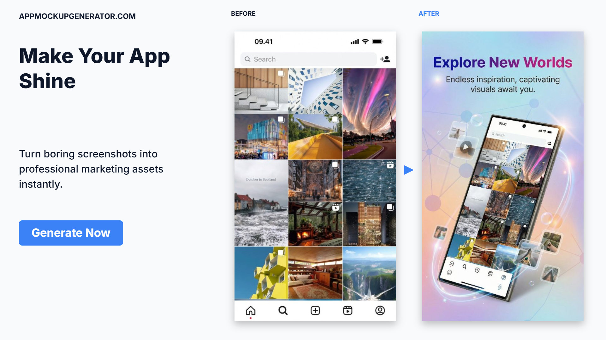
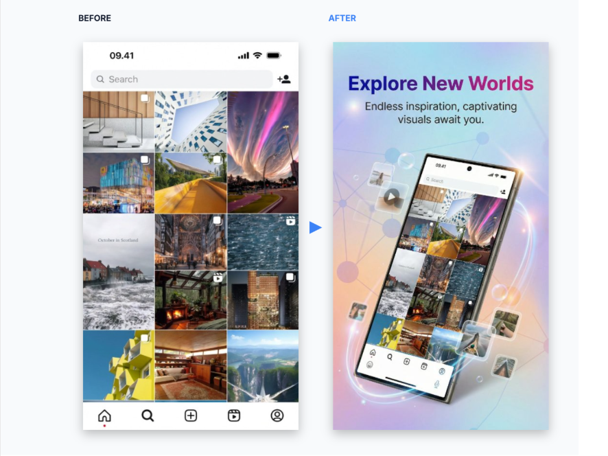

# App Store Screenshot Generator — Create Stunning App Screenshots in Minutes

**[AppMockup Generator](https://www.appmockupgenerator.com?utm_source=github&utm_medium=readme&utm_campaign=backlink)** is a free AI-powered app store screenshot generator that transforms plain app screenshots into professional, store-ready marketing assets — no design skills needed.

Upload your iOS or Android screenshots, and get polished mockups with device frames, backgrounds, and marketing copy in under 2 minutes.

---

## 🚀 What Is an App Store Screenshot Generator?

An **app screenshot generator** is a tool that takes your raw mobile app screenshots and turns them into visually compelling images optimized for the Apple App Store and Google Play Store. Instead of hiring a designer or wrestling with Photoshop, you can **generate app screenshots** that look professional with just a few clicks.

AppMockup is the fastest way to **create app store screenshots** that convert browsers into downloads.

---

## ✨ Key Features

| Feature | Description |
|---|---|
| **AI-Powered Generation** | Upload a screenshot and let AI generate marketing copy, backgrounds, and device frames automatically |
| **iOS App Screenshot Generator** | Create pixel-perfect screenshots sized for iPhone 16, iPhone 15, iPad Pro, and all required App Store dimensions |
| **Google Play Screenshot Generator** | Generate screenshots optimized for Pixel, Samsung Galaxy, and all Play Store listing requirements |
| **Play Store Image Generator** | Produce feature graphics (1024×500) and promotional images for your Google Play listing |
| **App Store Screenshot Templates** | Choose from dozens of professionally designed templates or let AI create a unique style for your app |
| **Device Mockup Frames** | Realistic iPhone, iPad, Pixel, and Galaxy device frames to showcase your app in context |
| **Marketing Copy Generation** | AI writes compelling titles and subtitles tailored to your app's features |
| **Bulk Export** | Download all screenshots as a ready-to-upload ZIP file |

---

## 📱 Before & After Examples

See how AppMockup transforms raw screenshots into store-ready assets:

### Recipe App — Profile Screen

> A plain profile screen becomes a polished marketing asset with device frame, custom background, and compelling copy — all generated by AI.

### Photography App — Gallery View

> Transform a standard gallery grid into an eye-catching Play Store screenshot with dynamic backgrounds and 3D device presentation.

### Social App — Content Feed

> Turn a content feed screenshot into a visually striking store listing image with AI-generated marketing copy and immersive backgrounds.

---

## 🎯 Who Is This For?

- **Indie developers** who need store-ready screenshots without hiring a designer
- **App marketers** looking to A/B test different screenshot styles quickly
- **Mobile dev teams** who want to iterate on store listings without waiting on design resources
- **Startup founders** launching on iOS and Android simultaneously
- **Freelancers** creating App Store and Play Store assets for clients

---

## 📐 Supported Screenshot Sizes

### Apple App Store (iOS)
| Device | Size (px) | Required |
|---|---|---|
| iPhone 6.9" (iPhone 16 Pro Max) | 1320 × 2868 | Yes |
| iPad Pro 12.9" | 2048 × 2732 | If supporting iPad |

### Google Play Store (Android)
| Asset | Size (px) | Required |
|---|---|---|
| Phone Screenshots | 1080 × 1920 (min) | Yes |
| Feature Graphic | 1024 × 500 | Yes |

---

## ⚡ How to Make App Store Screenshots

Creating professional app store screenshots with AppMockup takes just 3 steps:

### Step 1: Upload Your Screenshots
Drag and drop your raw iOS or Android app screenshots. The tool accepts PNG and JPG files of any size.

### Step 2: Let AI Do the Work
The **screenshot generator for app store** analyzes your app's UI, generates relevant marketing copy, selects complementary backgrounds, and wraps everything in a realistic device frame.

### Step 3: Download & Publish
Export your finished **app screenshots for app store** as individual images or a bulk ZIP file. Upload directly to App Store Connect or Google Play Console.

**[Try it free →](https://www.appmockupgenerator.com?utm_source=github&utm_medium=readme&utm_campaign=backlink)**

---

## 💰 Pricing

| Plan | Credits | Price |
|---|---|---|
| **Free** | 3 screenshots | $0 |
| **Starter** | 25 screenshots | $9 |
| **Pro** | 70 screenshots | $19 |
| **Business** | 150 screenshots | $39 |

The **free app store screenshot generator** gives you 3 credits to try it out — no credit card required.

**[Start generating for free →](https://www.appmockupgenerator.com?utm_source=github&utm_medium=readme&utm_campaign=backlink)**

---

## 🔗 Quick Links

- 🌐 **Website:** [appmockupgenerator.com](https://www.appmockupgenerator.com?utm_source=github&utm_medium=readme&utm_campaign=backlink)
- 📖 **Blog:** [App Marketing Tips & Guides](https://www.appmockupgenerator.com/blog?utm_source=github&utm_medium=readme&utm_campaign=backlink)

---

## 🔍 Related Tools

Looking for more app marketing tools? AppMockup also includes:

- **[Screenshot Analyzer](https://www.appmockupgenerator.com/screenshot-analyzer?utm_source=github&utm_medium=readme&utm_campaign=backlink)** — Get AI feedback on your existing store screenshots
- **[Screenshot Dimension Checker](https://www.appmockupgenerator.com/screenshot-dimension-checker?utm_source=github&utm_medium=readme&utm_campaign=backlink)** — Verify your screenshots meet store requirements
- **[Feature Graphic Generator](https://www.appmockupgenerator.com/feature-graphic-generator?utm_source=github&utm_medium=readme&utm_campaign=backlink)** — Create Google Play feature graphics
- **[App Icon Resizer](https://www.appmockupgenerator.com/app-icon-resizer?utm_source=github&utm_medium=readme&utm_campaign=backlink)** — Resize icons for all required dimensions
- **[Store Listing Preview](https://www.appmockupgenerator.com/store-listing-preview?utm_source=github&utm_medium=readme&utm_campaign=backlink)** — Preview how your listing looks before publishing
- **[Keyword Density Checker](https://www.appmockupgenerator.com/keyword-density-checker?utm_source=github&utm_medium=readme&utm_campaign=backlink)** — Optimize your store listing copy

---

## 📊 Why Your App Store Screenshots Matter

Your app store screenshots are the single biggest factor in conversion rates. Studies show:

- **70%** of users make download decisions based on screenshots alone
- Apps with professional screenshots see **25-35% higher conversion rates**
- The first two screenshots get **80% of all views** — make them count

Don't leave downloads on the table with plain, unformatted screenshots. Use an **app store screenshot creator** to make every pixel work for you.

**[Generate your screenshots now →](https://www.appmockupgenerator.com?utm_source=github&utm_medium=readme&utm_campaign=backlink)**

---

## 📄 License

This repository is for informational purposes. AppMockup Generator is a product of [appmockupgenerator.com](https://www.appmockupgenerator.com?utm_source=github&utm_medium=readme&utm_campaign=backlink).
